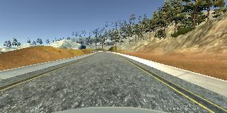
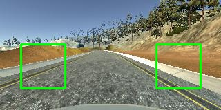

# Self-Driving-Car-ND-Predict-Steering-Angle-with-CNN

Predicting the steering angle of the car using CNN with center/front image as input.

## Overview
This repo is for the submission of Project 3 'Behavioral Cloning' in Udacity's SDC ND. The goal was to use a game simulator and drive a car using CNN.

## Collecting training data
The simulator allows you to drive the car manually and it captures front, left and right images along with speed, acceleration and steering angle of the car as you drive. You then use the training data captured by manually driving and teach CNN to drive and predict driving angle.

Earlier on while playing with the manual mode I realized that the car was very difficult to control using keyboard input. I didn't have a joystick so I decided to use computer vision to drive the car first.

The CV uses the same automatic mode in the simulator but when it gets an input image it predicts where the lanes are and then calculate the steering angle. As steering angle is also a function of how fast you are driving, it uses input speed as and steering angle and also returns accelerator and break setting of the car. The only drawback of this is that only center camera images are available in automatic mode that we save for training. We don't have access to left and right camera images right now.

Please refer to [this project](https://github.com/sjamthe/Self-Driving-Car-ND-Predict-Steering-Angle-with-CV) for details on how the CV drives the car.

## Model
Most of the steering angle prediction model including the one by Nvdia use complete single image as input to predict the angle. Even after cropping the image to a smaller size as in my CV program I found the image much larger to fit on the GPU memory.

 In my CV steering angle program I had noticed that sometimes it is hard find both left and right lane markings so I had to calculate the steering angle based on only one lane. I decided to write my CNN model with this idea in mind.

 I split my image into two parts. The left images trains a network to predict a steering angle, the same network (but a different model) predicts steering angle again. I look at the probabilities of both prediction and select the one with higher probability as the final steering angle.

### Data preparation
Each captured input image is 320 x 160 x 3. We crop a 64x64 block at 30,64 offset for left image and 64x64 at 226,64 offset for right image.

 

Each of the image is further downscaled to 32x32.

## Network
I had a very successful CNN network that I developed for traffic sign detection. I used transfer learning as the traffic model was trained on 50k+ images and I only had 10K images of driving data. Only difference between the two model is the last softmax layer. The last layer was replaced with 18 classes. The steering angle was limited to turn between -25 degrees and 25 degrees (or -0.43 radians and 0.43 radians). These were divided into 18 classes as we don't need very accurate steering angles in real life.

The network is
1. 3x3 conv layer with 32 depth relu activation and l2 regularizer
2. maxpool2d
3. 3x3 conv layer with 64 depth relu activation and l2 regularizer
4. 3x3 conv layer with 64 depth relu activation and l2 regularizer
5. maxpool2d
6. flatten
7. Dense CNN with 512 nodes and relu activation
8. 50% dropout layer
9. softmax with 18 classes

I use Adam optimizer and categorical_crossentropy for loss

## Accuracy
Out of the 10k images (15k later) I used 10% for testing, 10% for validation
The model trained on left images had an accuracy of 97.8% an the one trained on right images was 96.2% accurate. But the combined accuracy of the model was 98.2% as I am able to select steering angle from any of the model based on their probability of success.

# Future Ideas
It is very hard to see what exactly the model is learning and what it really saw in the image that resulted in the steering angle prediction. This is unsettling for me. So my goal is to actually use the left model to predict the left lane (slope, intercept) and right model to so that for right image.
This way I can deaw the lanes on the image just like I did in CV model. This will make is very clear if lanes are not detected and I can replace those images with correct lane markings and retrain.
The final model will take the left and right lanes as input and predict output.
My CV program uses previous lanes to do a better prediction lanes on images that are not clear. That will be possible in this model as well.

I also want to increase the left and right image size
